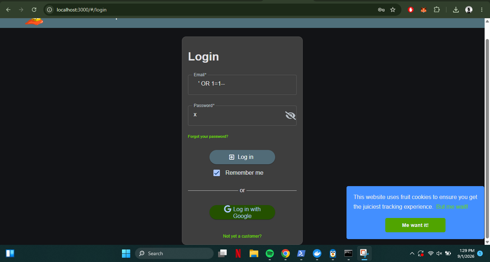
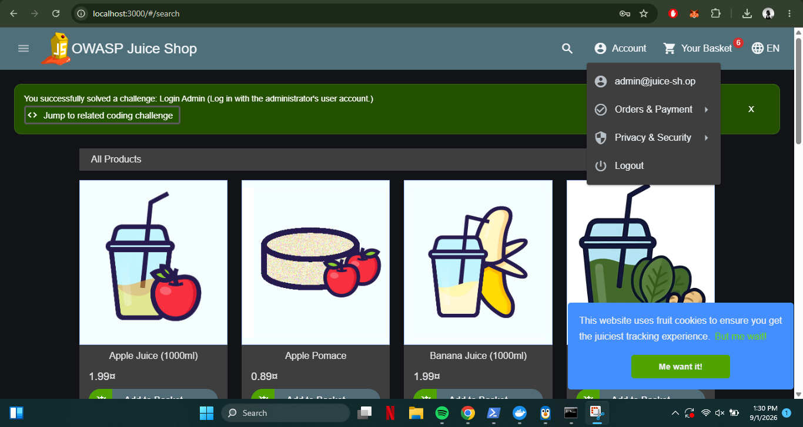
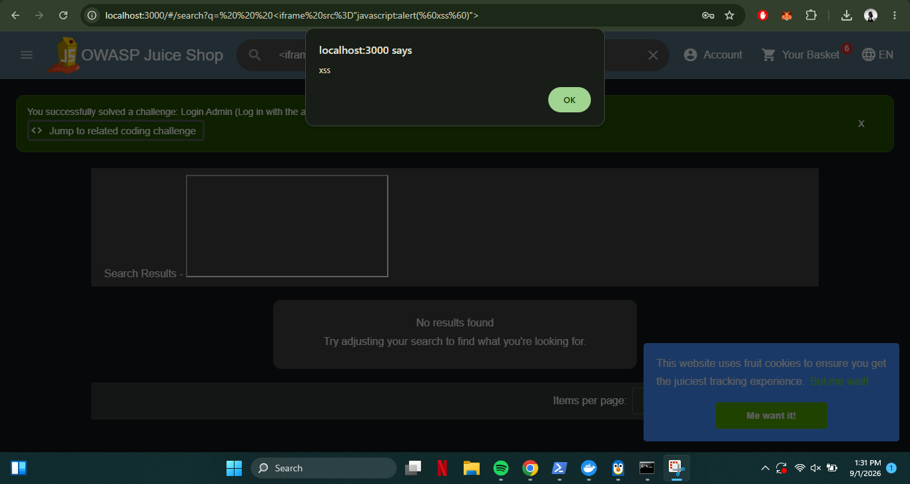
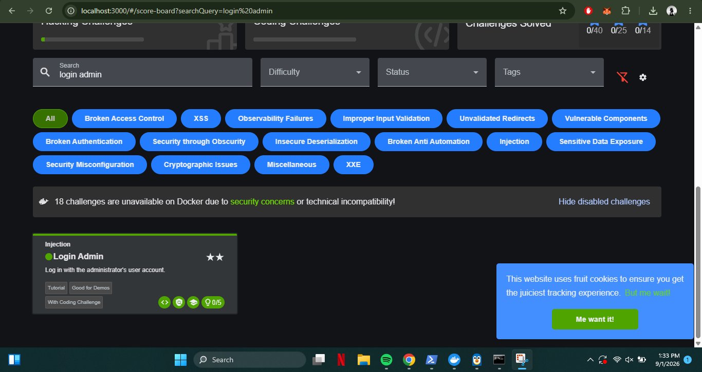
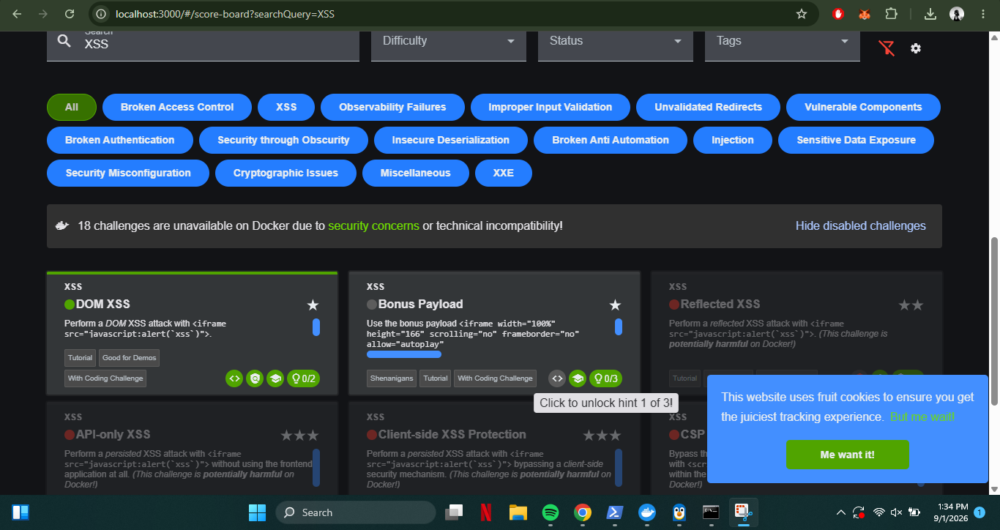

# OWASP Juice Shop — SQL Injection & XSS

**Intern:** Abdullah Khan
**Domain:** Cyber Security
**Program:** DATANEX Internship — Week 3 Task
**Challenge:** [OWASP Juice Shop](https://owasp.org/www-project-juice-shop/)

## Overview

This repository documents the completion of two beginner-level web security
challenges on OWASP Juice Shop, an intentionally vulnerable web application
built by the OWASP Foundation for legal, hands-on security training. The
application was deployed locally in an isolated Docker container, so all
testing was contained to a private sandboxed instance with no risk to any
real system.

Two vulnerability classes were explored:

1. **SQL Injection** — bypassing authentication logic by manipulating a
   backend database query.
2. **Cross-Site Scripting (XSS)** — injecting and executing arbitrary
   JavaScript in the browser via unsanitized input.

## Environment

- Target application: OWASP Juice Shop (`bkimminich/juice-shop`)
- Deployment: Docker Desktop, local container
- Access URL: `http://localhost:3000`
- Browser: Google Chrome

## Challenge 1 — SQL Injection: Login Bypass

**Goal:** Log in as the administrator without knowing the real password.

The login form builds a query similar to:
```sql
SELECT * FROM Users WHERE email = '<input>' AND password = '<input>'
```

**Payload used (Email field):**
```
' OR 1=1--
```
**Password field:** any value (e.g. `x`)

The single quote closes the string literal, `OR 1=1` is always true, and
`--` comments out the rest of the query (including the password check),
so the database returns the first matching user — the administrator
account — without validating any password.




## Challenge 2 — Cross-Site Scripting (XSS): DOM XSS

**Goal:** Trigger a JavaScript `alert()` via the search bar.

**Payload used (Search field):**
```html
<iframe src="javascript:alert(`xss`)">
```

The search feature reflects the query directly into the page's DOM without
sanitizing it. The injected `<iframe>` executes its `javascript:` URI as
soon as the browser renders it, popping a JavaScript alert box — proof the
input was treated as executable code rather than plain text.



## Verification — Score Board

Both challenges were confirmed via Juice Shop's built-in Score Board, which
marks solved challenges with a green indicator.




## Key Learnings

- How SQL Injection alters backend query logic using unsanitized input,
  and how comment sequences (`--`) can strip out parts of a query.
- How DOM-based XSS occurs when user input is reflected into the page
  without sanitization, letting injected HTML/JavaScript execute.
- The real-world defenses against both: parameterized queries /
  prepared statements for SQLi, and input validation + output encoding
  for XSS.
- How to safely deploy and test against an intentionally vulnerable app
  using an isolated Docker container.

## Full Report

A detailed write-up with front page, methodology, and full screenshots is
included in the DATANEX internship submission (Word/PDF), submitted
separately via the DATANEX Intern Portal.
